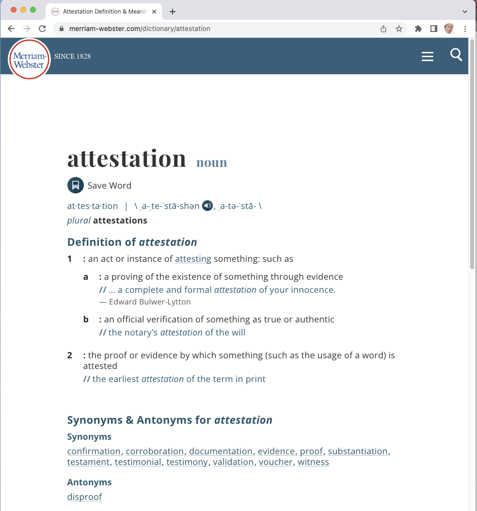

m4_include(../../../setup.m4)

Lecture 02 - What is a BlockChain - more on Go.
----------------

## News

1. Canadian Steel / Supply chain tracking on blockchain.
2. LinkedIn ranks blockchain as the number two technology skill companies need in 2021.
3. Digital Dollar - from fed report could effect stability of dollar.
4. NFTs - OpenSea trades 4.5 billion in one month.

## Question: What is a **hash**?

1. (math) a mapping form a range to a domain.

2. Text to a number.
```
	abc               275f20377d6574b67399702947cb56849d2e02f7112c1d021603346c345b37f8
	abd               3212601953780d3a8de118531b87bf6183edb8c81baf6982fdca260033a5f29b
	war-and-peace.txt 67c570b0e09d70225d739aec9a7ea91631df1ea06ba44f0c9d9fe99e45f41756
```

3. Different kinds of hash, MD5, SHA1, SHA256, SHA3, SHA512, Keccak256.


## **attestation** - Definition of attestation - From Websters Dictionary.

<br>
[https://www.merriam-webster.com/dictionary/attestation](https://www.merriam-webster.com/dictionary/attestation)


1. an act or instance of attesting something: such as
	1. : a proving of the existence of something through evidence
	  … a complete and formal attestation of your innocence. —Edward Bulwer-Lytton
	2. : an official verification of something as true or authentic the notary's attestation of the will
2. the proof or evidence by which something (such as the usage of a word) is attested the earliest attestation of the term in print


## Economics of Blockchain

This is an up/down year in the cryptocurrency world. China, India and a few other countries have banned it.
On the flip side the US and about 1/2 of the world are looking to replace national currencies with it.

In 2009 - bitcoin invented.  

In 2013 - smart contracts - Ethereum.

In 2021 - 6% of transactions in 6 African countries on it.
China and Russia are moving to replace national currency with it.
Goldman Sacks / Apple are using it.  Visa expects $1T in transactions on it.

Ability to create trust between non-trusting parties.

Ability to create economic systems.

Merick - shipping 40% decrease in shipping times.  World wide $380 Billion in trade.  90% of all the goods
in the world are moved by ship.  38 days average shipping time. A 40% reduction is dropping that to 23 days.
Difference is 15 days.  40% of 380 billion is 152 billion in capital that is not tied up - at an average
capital cost of 10% = 15.2 billion - over the 23 days.  15/365 * 15.2 billion. -- About 0.62 billion.

Estonia - All titles and property on the chain.  In US 5.51 Million Houses.  Average title search $3821.
Title search in Estonia, $23.33 each.  Title insurance $1408.  My calculation $19 billion a year.

Marshal Islands - off of the dollar and onto a blockchain.   The estimate is that the government will
save around $5M a year or about $90 per resident a year.  For entire US 327 million - that is $29 billion
dollars.

Over 22 accredited educational educational institutions now issuing certificates based on blockchain.
(Especial Interest in this because this is our project)

Perspective on 28 or 29 billion - free college tuition for all students in the United States is
estimated to cost 75 billion.

State of Nevada - Marriage license on blockchain.  

The largest "blockchain" sale is valued at 103 million.   In a commercial property in Zurich.

## Go - Intro

Assignment 1 - Due Mon Feb 3

### Hello World - walk through

```
m4_include(hw.go.nu)
```

### Echo - walk through

```
m4_include(echo/main.go.nu)
```

1st time - or when you change dependencies

```
$ mkdir echo
$ cd echo
$ vi main.go
$ go mod init
$ go mod tidy
$ go build
```

After that

```
$ go build
```

### Marshal and Unmarshal of data - walk through

```
m4_include(marshal/marshal.go.nu)
```

```
m4_include(unmarshal/unmarshal.go.nu)
```

### For loops

```
m4_include(for/main.go.nu)
```

### Functions


```
m4_include(funcDemo/main.go.nu)
```

```
m4_include(funcDemo/qs_test.go.nu)
```


