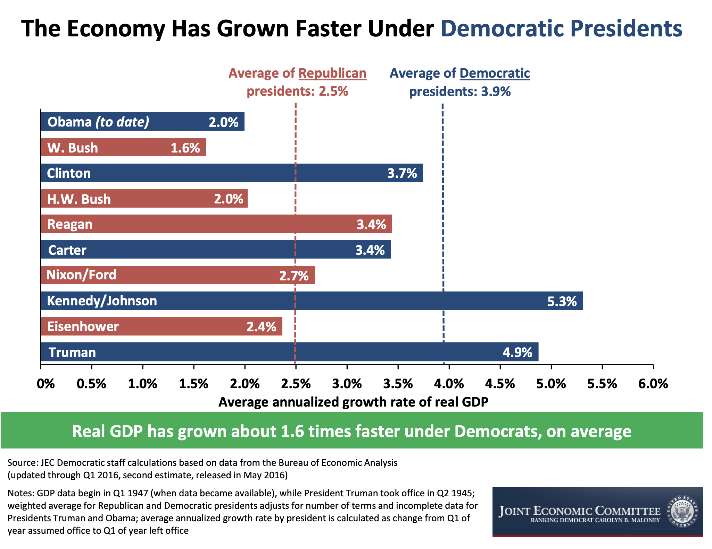

m4_include(../../../setup.m4)

# Lecture 05 - News, Stocks, Go


## News

1. Crypto Crash....

New York Times, Today, Fri Jan 28 06:18:24 MST 2022 <br>
[https://www.nytimes.com/2022/01/27/opinion/cryptocurrency-subprime-vulnerable.html](https://www.nytimes.com/2022/01/27/opinion/cryptocurrency-subprime-vulnerable.html)

"Recent developments in El Salvador, which adopted Bitcoin as legal
tender a few months ago, seem to bolster the skeptics: Residents
attempting to use the currency find themselves facing huge transaction
fees. Still, crypto has been effectively marketed: It manages both
to seem futuristic and to appeal to old-style goldbug fears that
the government will inflate away your savings, and huge past gains
have drawn in investors worried about missing out. So crypto has
become a large asset class even though nobody can clearly explain
what legitimate purpose it’s for."

2. Turkey - attempting to support the Lyra - ForEx down to 7.55B, 
with $10-11b a month in foreign gas purchases.  An inflation forcast
from the CBT (Central Bank of Turkey) of 22.3% - and - desperate 
measures.  If a country can't support its own currency how do you
expect Teather to support it's?

3. Facebooks, Deim project offically shuts down.
[https://www.washingtonpost.com/technology/2022/01/28/facebook-cryptocurrency-diem/](https://www.washingtonpost.com/technology/2022/01/28/facebook-cryptocurrency-diem/)

"...so that it would be pegged to the U.S. dollar to create more stability..."

"...16 percent of Americans have invested in or traded cyptocurrencies..."

From: [https://www.forbes.com/sites/teresaghilarducci/2020/08/31/most-americans-dont-have-a-real-stake-in-the-stock-market/?sh=5783d5331154](https://www.forbes.com/sites/teresaghilarducci/2020/08/31/most-americans-dont-have-a-real-stake-in-the-stock-market/?sh=5783d5331154)

"...via the Federal Reserve from 2016, shows a relatively small
share of American families (14%) are directly invested in individual
stocks but a majority (52%) have some market investment mostly from
owning retirement accounts such as 401(k)s."


## An example of Arbitrage

Stocks v.s. Realest - over - Democrat v.s. Republican.




More On Go 
====================

Maps do not synchronize automatically.
So... Synchronization Primitives:

```Go
m4_include(safe_counter.go.nu)
m4_comment([[[
package main

import (
	"fmt"
	"sync"
	"time"
)

// SafeCounter is safe to use concurrently.
type SafeCounter struct {
	v   map[string]int
	mux sync.Mutex
}

// Inc increments the counter for the given key.
func (c *SafeCounter) Inc(key string) {
	c.mux.Lock()
	// Lock so only one goroutine at a time can access the map c.v.
	c.v[key]++
	c.mux.Unlock()
}

// Value returns the current value of the counter for the given key.
func (c *SafeCounter) Value(key string) int {
	c.mux.Lock()
	// Lock so only one goroutine at a time can access the map c.v.
	defer c.mux.Unlock()
	return c.v[key]
}

func main() {
	c := SafeCounter{v: make(map[string]int)}
	for i := 0; i < 1000; i++ {
		go c.Inc("somekey")
	}

	time.Sleep(time.Second)
	fmt.Println(c.Value("somekey"))
}
]]])
```

### A Go Core/Panic 

First the Code

```Go
m4_include(go_panic.go.nu)
m4_comment([[[
package main

import "fmt"

var mm map[string]int

func main() {
	fmt.Println("vim-go")
	mm["bob"] = 3
}
]]])
```

Then the bad output.


```
m4_include(go_panic.out)
m4_comment([[[
vim-go
panic: assignment to entry in nil map

goroutine 1 [running]:
main.main()
	/Users/philip/go/src/github.com/Univ-Wyo-Education/S22-4010/class/lect/04/go_panic.go:9 +0x71
exit status 2
]]])
```


## Stock Stuff


m4_comment([[[
	- Why "stock" stuff 
	- 
	- WY Laws / National Laws
	- What are stocks, What are NFTs - why a NFT offering may be a stock.  Reg(D).
	- What is a bond
	- What is yield
	- How are dividends payed
	- 
	- Other investments ( Diamonds, Gold )
	- Other fiancial instruments ( gets/puts, derivatives etc )
]]])


What is a Stock?

What is a Dividend?

SEC Reg(D)?

SEC Enforcement of Securities Laws.

Wyoming Laws on Stocks.

What is a NFT - and is it a security?

What is a Bond?  What is a Fixed Coupon v.s. a Variable Capon?

What is Yield?

How are dividends payed?

Other Investments (Gold, Diamonds, Houses, Apartments)

