

# Lecture 11 - Elliptic Curve

## Feb 11 2022

Every transaction has to be digitally signed to verify that the author
of the transaction (the spender) is valid.   Both Bitcoin and Ethereum
use EC cryptography to do this.  Specifically the ECDSA or Elliptic Curve
Digital Signature Algorithm to do this.

Let's take a look at how EC works.  This is not a how-to-implement EC,
this is, "lets understand EC enough that we can effectively use EC" approach.

Let a = -3 and b = 5 with:

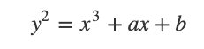

We get a graph that looks like

Note: it is not a function.   

Also there are good and bad elliptic curves for this so picking a good one
is required.  

Also this process will require prior agreement between the parties on what
curve is to be used.  So we have a bunch of standardized curves like
Curve25519 and P-256 etc.

For our example we have a tiny curve with small values - the real values
are `2**256` in size.

We can define addition on this curve with points `A` and `B` as, find `A`, find `B`,
draw a line between them - switch sides and this is `A + B`.

It is important to node that we do not have any definition of subtraction.
This will be our "trapdoor" later in our encryption process.  All of our
operations are uni-directional.

Given that we have addition we can define multiplication as using repeated
addition.  We will get a more efficient multiplication later.   Since
subtraction is not defined, there is no division.

Let's add a new value, 'C'.

All of this is good until we find that `A == B`, or we are adding a point
to itself.   Let's call this point P where we are adding `P + P`.
We can't draw a line from `P` to `P`, so what we need is the tangent 
line to the point `P`.

Our original formula is, `y**2 = x**3 -3x + 5`, so let's take the derivative
as that gives us the tangent to a curve.   We have to take the derivative on
both sides, then combine because this is not a function.

So... that gives us `dx/dy y**2 = 2y` and `dy/dx x**3 -3x + 5 = 3x**2 - 3`.
Now we combine to get a function:  `( 3x**2 - 3 ) / 2y` and we can calculate
the slope of our tangent line!

So `P + P == 2P` looks like:

It turns out that we will want `2P + P == 3P` a little later so this 
works out as just doing the `P + P = 2P` above, then doing a `2P + P`
add operation.   

The results look like:

So we can multiply `N` times `P` to get `NP`.

This looks like...

After doing this is there any way to determine `P` from `NP`.
Remember that subtraction and division are not defined.  So with
large values of `P` and `N` we have a one way function.

`NP` is our public key - the one we share with the world.
`N` is our private key.  Think non-private = `NP` and 
private = `N` for Never-Loose-This, but if we have more than one party we will
make `N` be `M` for the 2nd party. (That makes `M` more-never-loose-this).

## Faster Multiplication.

If we had to do repeated addition to get multiplication this would be
**really** slow!   But there is a process.  First you need to remember that
we store numbers in binary.  Also we have to have some algebra applied.
We need `A + ( B + C ) == ( A + B ) + C`.   The proof of this is really
complex.   If you want to read about its See [Elliptic Curves Group Law](EllipticCurvesGroupLaw.pdf)
in this lecturer's notes.

By knowing this we can determine that `P + 3P == 2P + 2P == 4P`.

So a binary number, let's say `227P` is really:

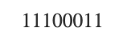

And that is an representation of a sum that looks like:

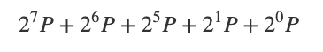

With the exponents converted:

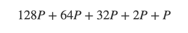

So we can just double and add:

1. Add P and double P
2. Add 2P and double 2P
3. Double 4P
4. Double 8P
5. Double 16P
6. Add 32P and double 32P
7. Add 64P and double 64P
8. Add 128P and double 128P

This makes our `P + P` derivation above really important because we are doubling and adding
all the time.

In 8 steps we have multiplied by 227.    This gives us an `O(log n)` way to multiply and with
a real size of `2**256` for our space we know that we can multiply any number in 256 steps.

## Key Exchange.

Lot's of times we want 2 parties to be able to exchange keys without every transmitting the
keys to each other.    The keys are values that we can then use in a symmetric encryption 
system, like Aes256.   Aes256 takes a 32 byte key, so a `2**256` key is just perfect - it is
32 bytes!

To setup our communication we do this key-exchange, then each side has the key (without ever
transmitting it) and then they each use Aes256 to encrypt data.  This leaves out a bunch
of details that are important but is the underlying system with TLS 1.3 that supports `https:`
in our browsers.

This process is called Elliptic Curve Diffie-Hellman.

Let's start with `4 * 3 = 12` and `3 * 4 = 12`.  This relies on our group law.

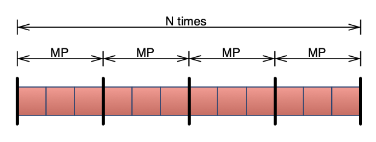

Is the same as:

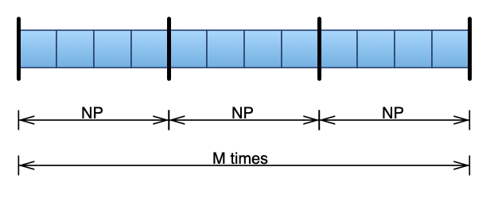

Both parties, `A` for Alice and `B` for Bob agree before hand on what the starting point `P` is 
and what curve they are working on.    So they can share public keys, `MP` and `NP`.   Now each
of them will compute:

`N * MP`:

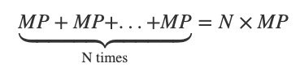

And `M * NP`:

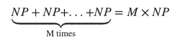

Each of these values generates the same result, `N * MP == M * NP`.   The resulting value is
secret because Bob keeps `N` a secret and Alice keeps `M` a secret.  So without sending values
they can each derive a key.

## Encrypted Communication 

Once we have the ability to share keys - encrypted communication becomes easy.  Perform
the key share process.  Then take the shared keys and use Aes256 to encrypt the data.  The
one thing that you have to do is verity that each side authentic - that the public key `MP`
and `NP` really belong to the people that are using the key.

The web-of-trust that is in `https` provides this.  Let's Encrypt today provides about 3/4
of all the `https` keys in the world.   To get a key you have to prove that the domain
you are getting the key for is yours.  Suppose your domain is `pschlump.com`.   Let's Encrypt has a protocol called ACME.  They
give you a secret and  (big random number) and you put that into a file on your server
in a know location, `http://pschlump.com/.knownsecrets/acme.txt`.  Then Let's Encrypt fetches back the secret - from the domain.
If it matches then you control the domain and they provide you with a set of Public/Private
keys for the domain.   When somebody visits the site they ask Let's Encrypt for the hash of the public key for `pschlump.com` and
ask `https://pschlump.com` for it's public key.  They hash the key and compare to the results from Let's Encrypt.  If they match
then then know that you are using the correct public key.

## All of this can be done on integers!

All of the graphs so far have been continuous - floating point calculations are inaccurate - and when you encrypt you don't 
want inaccurate results.  So... We can do all of this on integer only values.   This is what is called a `finite field`
in math.

Using the same a = -3 and b = 5 with a modulo number of `p = 19`
(this is really icky because we use `p` lower case to be the modulo
size and `P` to be the picked shared staring point.   Careful to
not mix your `P`s with you `p`s.  I often wonder if mathematicians
know that you can declare a variable with more than 1 letter?  In
other papers this is referred to as **Order(n)** and this is much
better.)

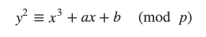

we get a set of points that looks like:

In this `y*2 (mod p)` is exactly equal to a new point at `x**3 - 3x + 5`.  Let's try a calculation:

Given a point `(11,7)` where `x = 11 and y == 7`, let's start on the y side with, `y**2`:

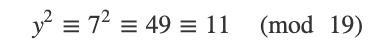

and `x` side with:

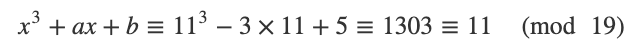

Visualizing this gives us:

## Signatures and Validation

So... there are a bunch of uses of EC but the use that we want is to **sign** content to prove that the person holding the private key `N` is who they claim to be.
In Bitcoin and Ethereum (and our homework) we are using this to verify transactions - this keeps other people from opening the UTxO's that belong to you.

In our examples `p` the (Order(n)) size of our examples is 19.  It has to be relatively prime and is a prime number in this case.

Our starting point, `P` is `(11,7)`.  In the real Ed25519 signature system (Based on Curve25519) the modulo value is the `2**255-19` and the base point is

x=15112221349535400772501151409588531511454012693041857206046113283949847762202

y=46316835694926478169428394003475163141307993866256225615783033603165251855960

So big numbers...

Curve25519 also defines the values that give us the exact curve (the 'a' and 'b' values).

### Signing Algorithm

Input is our public and private keys.   You have to have the private key to sign, you have to have the
public key to verify.  The agreement on curve, starting point and order need to be in place to start
the this.

Output is a pair `{r,s}` that act as a verifiable signature.  In our special case this is actually `{r,s,v}`
where v is a 0, 1 (we will get back to `v` in a moment)

1. take the message and calculate the hash of the message.  This is a 32 byte Sha256 or Keccak hash of the message.
`h = hash(msg)`.
2. Generate securely a random number `k` in the range `[1..n-1]`.  The value must be from 1 to `2**256` in our case.  So a 32 byte random value.
3. Calculate the random point `R = k * P` and take its x-coordinate: `r = R.x`
4. Calculate the signature proof: 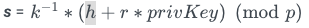
6. Return the `signature {r, s}`.

## Verification Algorithm

The algorithm to verify a ECDSA signature takes as input the signed message msg + the signature {r, s} produced from the signing algorithm + the public key pubKey, corresponding to the signer's private key. The output is boolean value: valid or invalid signature. The ECDSA signature verify algorithm works as follows (with minor simplifications):

1. Calculate the message hash, with the same cryptographic hash function used during the signing: `h = hash(msg)`.   This can also be achieved by passing both the message, the hash and then re-hashing the message and comparing the generated hash with the passed hash.   We will do it this way.
2. Calculate the modular inverse of the signature proof: 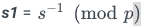
3. Recover the random point used during the signing: `R' = (h * s1) * G + (r * s1) * pubKey`
4. Take from `R'` its x-coordinate: `r' = R'.x`
5. Calculate the signature validation result by comparing whether `r' == r`

The idea behind signature verification is to recover the point `R'` using the public key and check whether it is same point `R`, generated randomly when the message was signed.

This scheme allows for the recovery of the public key from the signature and the message.  This means that a receiver of a signed message will not need to keep a huge table
of all public keys around.  The disadvantage is that you have to check the recovered key is the correct public key for the account.  In our system (and Ethereum) are accounts
are the first 24 bytes of the 32 byte public key.  So when we recover the public key we chop it to 24 bytes and compare it to the account number.

Also when we recover a public key we can get 4 different answers.  This is what the `v` value is used for.  

